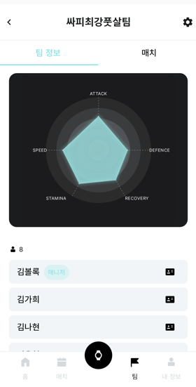
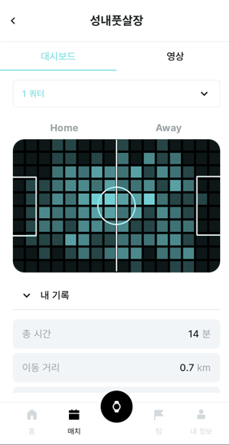
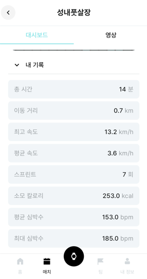
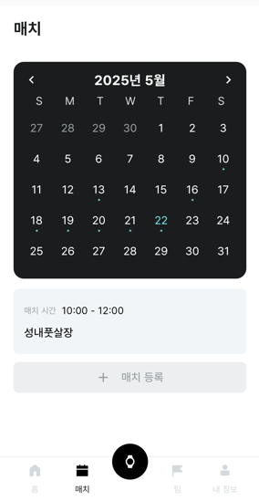
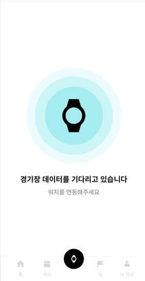
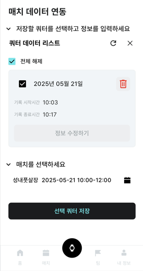
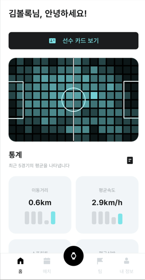
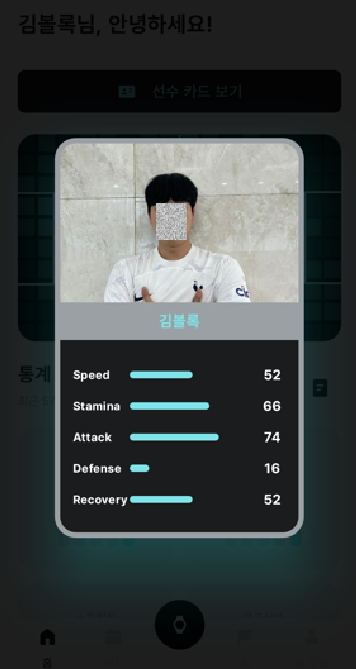
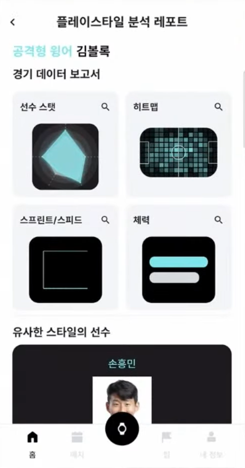
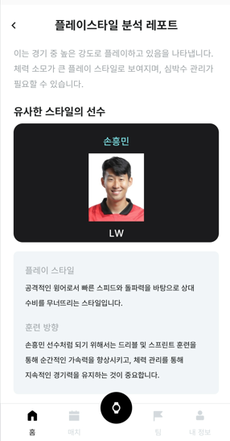

# 🏆 Ballog: 스마트워치 기반 풋살 경기 측정 및 분석 서비스

## 📌 프로젝트 개요

**Ballog**는 스마트워치를 활용하여 풋살 경기 중 선수들의 데이터를 수집하고, 이를 분석하여 선수 능력치를 산출하고 맞춤형 피드백을 제공하는 서비스입니다. 경기 중 수집된 GPS 히트맵, 심박수, 스프린트 등의 데이터를 기반으로 공격력, 수비력, 스피드, 스태미나, 회복력 등의 능력치를 계산하고, AI를 활용해 유사한 플레이 스타일의 프로 선수를 추천합니다.

## 📱 앱 주요 화면

### 팀 정보 및 능력치 시각화


### 경기 데이터





### 매치 일정 관리


### 경기 데이터 수집 및 저장




### 메인 프로필, 선수 카드, 플레이 스타일 분석








## 🧠 주요 기능

### 1. 경기 데이터 수집 및 분석
- 스마트워치를 통한 실시간 경기 데이터 수집 (GPS 위치, 심박수, 스프린트, 이동 거리 등)
- 경기 쿼터별 데이터 기록 및 분석
- 히트맵 기반 진영 점유율 분석 및 시각화

### 2. 선수 능력치 산출
- 수집된 데이터를 바탕으로 5가지 능력치 산출 (공격력, 수비력, 스피드, 스태미나, 회복력)
- 경기 참여 횟수에 따른 능력치 지속 업데이트
- 플레이어 카드 시스템을 통한 능력치 시각화

### 3. AI 기반 플레이 스타일 분석
- OpenAI API를 활용한 플레이 스타일 분석
- 유사한 플레이 스타일의 프로 축구 선수 추천
- 개인별 맞춤형 훈련 방향 제시

### 4. 팀 및 매치 관리
- 팀 생성 및 멤버 관리 기능
- 경기 일정 관리 및 기록 저장
- 개인 및 팀 통계 데이터 제공

## 🛠️ 기술 스택

### 백엔드
- **언어 및 프레임워크**: Java, Spring Boot
- **데이터베이스**: PostgreSQL(PostGIS), Redis
- **인증**: JWT 기반 인증 시스템

### AI 및 데이터 분석
- **자연어 처리**: OpenAI API (GPT 모델)
- **데이터 분석**: 복합 알고리즘 기반 능력치 계산 시스템
- **크롤링**: Jsoup을 활용한 프로 선수 이미지 크롤링

### 인프라
- **컨테이너화**: Docker, Docker Compose
- **CI/CD**: GitLab CI/CD
- **클라우드**: AWS EC2, S3
- **웹 서버**: Nginx

## 🏗️ 시스템 아키텍처

```
[스마트워치] → [모바일 앱]
      ↓
[Spring Boot 백엔드] → [Redis(캐싱)]
      ↓
[PostgreSQL(데이터 저장)]
      ↓
[OpenAI API(분석)] → [사용자 맞춤형 피드백]
```

## 💡 주요 알고리즘

### 능력치 계산 알고리즘
- **공격력**: (상대진영 점유율 * 0.6) + (스프린트 횟수/경기시간 * 0.3) + (최고 속도/20 * 0.1) * 100
- **수비력**: (자기진영 점유율 * 0.7) + (스프린트 횟수/경기시간 * 0.15) + (이동거리/경기시간 * 0.15) * 100
- **스피드**: (평균 속도/10 * 0.4 + 최고 속도/20 * 0.6) * 100
- **스태미나**: (경기시간/15 * 0.4 + 이동거리/(경기시간 * 80) * 0.4 + (1-(평균 심박수/최대 심박수)) * 0.2) * 100
- **회복력**: (최대 심박수-평균 심박수)/60 * 100

## 🚀 설치 및 실행 방법

### 사전 요구사항
- Docker 및 Docker Compose 설치
- JDK 17 이상
- PostgreSQL 15 (PostGIS 확장 포함)
- Redis 7.0

### 실행 방법
1. 저장소 클론
   ```bash
   git clone https://lab.ssafy.com/s12-final/S12P31A404.git
   ```

2. 환경 변수 설정
   ```bash
   # .env 파일 생성
   DB_URL=your_db_url
   DB_USERNAME=your_db_username
   DB_PASSWORD=your_db_password
   ```

3. Docker Compose 실행
   ```bash
   docker-compose up -d
   ```

4. 서비스 접속
   ```
   http://localhost
   ```

## 🔖 팀 구성 및 역할

- 백엔드 개발: Spring Boot 기반 API 개발, 데이터 처리 및 분석 시스템 구축
- 프론트엔드 개발: 모바일 앱 개발, 사용자 인터페이스 설계
- 인프라 관리: Docker 컨테이너화, CI/CD 파이프라인 구축, AWS 배포
- AI 모델링: OpenAI API 연동, 맞춤형 분석 시스템 개발

## 📊 프로젝트 성과

- 스마트워치 센서 데이터를 활용한 복합적 분석 시스템 구축
- 실시간 데이터 처리 및 분석 파이프라인 개발
- AI 기반 개인화된 피드백 시스템 구현
- 데이터 기반 선수 능력치 산출 및 시각화 서비스 개발
